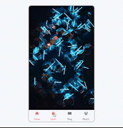

# About

The Mobile Tab Application is based on a mobile UI style that will display the options tab down the bottom of the app. In addition, it will change the image if you navigate the tab you click. This feature allows you to change states mapping over with the image the tabs hold. 

## Used Library

The library used for display icons on application is from [font awesome](https://cdnjs.com/libraries/font-awesome).

## Images Used

The images used on the application is from [Unsplash](https://unsplash.com).

## Application Preview

